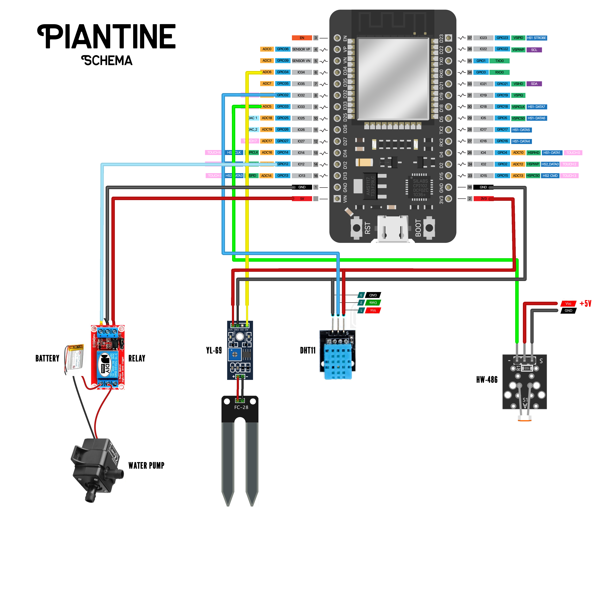

# Piantine
ESP32 greenhouse

## Libraries
- Arduino_JSON by Arduino_JSON
- Adafruit Unified Sensor by Adafruit
- AsyncTCP by ESP32Async
- ESP Async WebServer by ESP32Async
- DHT sensori library by Adafruit
- Rtc by Makuna (https://github.com/Makuna/Rtc)

## Wiring
- Relais: GPIO12
- Water level (YL-69): A6
- Temp&Humidity (DHT11): GPIO32
- Light (HW-486): A6
- Clock: GPIO26, GPIO27, GPIO14
